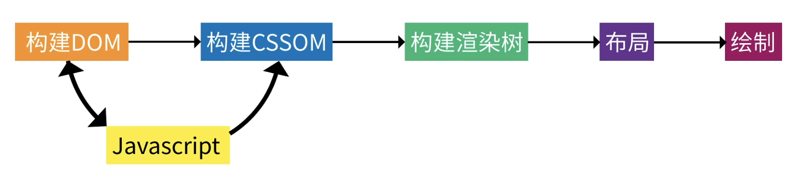
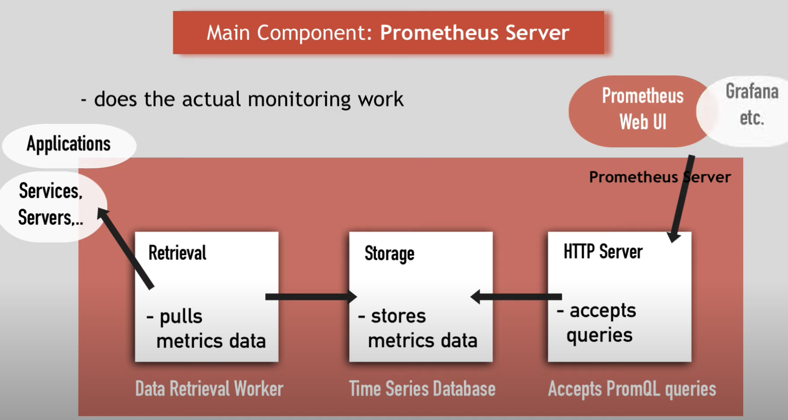
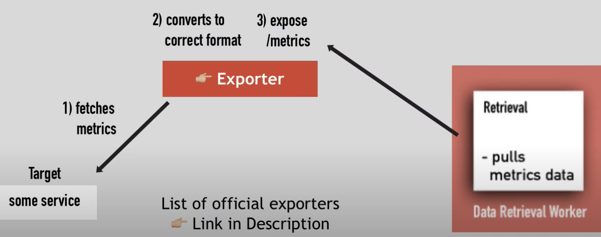

- [x] 跨域

  - CORS
    - **简单请求（Simple Requests）**和**需预检请求（Preflighted requests）**
    - Access-control-allow-origin 来源
    - Access-control-allow-methods
    - `Access-Control-Allow-Headers` 表示允许的请求头
    - `Access-Control-Allow-Credentials` 表示允许携带认证信息
  - 反向代理
    - 正向代理 客户端的配置 如 VPN
    - 反向代理 服务端
    - （网上很多教程是 CORS 和反向代理混用 我怀疑他们根本没掌握原理）
  - JSONP
    - script 标签不受同源限制

- [x] 输入一个 url 地址的全过程

  - DNS 解析拿到 IP

    - Socket
    - 协议栈（下面详细讲）
    - DNS 服务器（缓存）
    - 根域

  - 建立TCP通道

    - 计算机网络层次结构：
      - 应用层 HTTP（浏览器）
      - Socket
      - 操作系统中的协议栈
        - **传输层 TCP/UDP**
          - TCP 头带有端口号
          - 三次握手，类比叫号的过程
        - **网络层 IP **
          - IP 头
          - ARP 协议查询 MAC 地址并加上 MAC 头部
      - 数据链路和物理层：交换机、路由器
    - 三次握手（类比与叫号）

  - 页面的渲染

    

- [x] Prometheus 

  

  - Server

    - Time Series Database: stores metrics data

    - Data Retrieval Worker: pulls metrics data

    - Web Server: accept promql queries

  - Exporter

    

  - Pushgateway

    - short-lived

  - Alert Manager

  - Grafana

- [ ] react

- [x] 正则

  - https://www.bilibili.com/video/BV1QK4y1K72U
  - `+` 1~ 
  - `*` 0~
  - `?` 0 or 1
  - `^` `$`

- [x] filter sort

- [x] debouncing or throttling

  ```js
  // console.log('start')
  function throttle() {
  
  }
  
  function debounce(fn, delay) {
    let timer
    return function() {
      const context = this
      if (timer) clearTimeout(timer)
      timer = setTimeout(() => { fn.call(context, ...arguments) }, delay)
    }
  }
  
  function myThrottle(fn, delay) {
    let timer
    return function() {
      const context = this
      if (timer) return
      timer = setTimeout(() => { fn.call(context, ...arguments) }, delay)
    }
  }
  
  function foo(str = '') {
    console.log(str)
    console.log(this)
    console.log('====')
  }
  
  
  
  const debouncedFoo = debounce(foo, 1000)
  const throttledFoo = myThrottle(foo, 1000)
  const obj = {
    foo,
    debouncedFoo,
    throttledFoo
  }
  // obj.foo('hello world')
  // obj.debouncedFoo('hello world')
  // obj.throttledFoo('hello world')
  ```

- [x] 浏览器的渲染过程

  - Tokenize | DOM + CSSOM -> 渲染🌲 | layout（盒子模型）| 绘制（像素）|

- [x] prototype

  

- [x] 二叉树层次 构造 js class member variable

- [x] sessionstorage localstorage cookie

  |                | cookie               | localStorage         | sessionStorage   |
  | -------------- | -------------------- | -------------------- | ---------------- |
  | 大小           | 4KB                  | 5MB                  | 10MB             |
  | 访问           | 同源条件下，任何窗口 | 同源条件下，任何窗口 | 同一窗口（会话） |
  | 有效期         | 手动设置 max-age     | 无                   | 窗口关闭（会话） |
  | 与请求一起发送 | 是                   | 否                   | 否               |
  | 存储位置       | 服务器和浏览器       | 浏览器               | 浏览器           |

  - localstorage 是同步的 太大会影响渲染进度

- [ ] class `this` ? `block` ?[^1]

- [ ] swr + react dnd + monitoring

- [x] JWT cookie session:

  - session 给服务器增加了内存负担 | 分布式
  - Header.Payload.Signature | 私钥

- [x] 深拷贝和浅拷贝

  - 深拷贝：JSON.stringify() JSON.parse()
  - 浅拷贝：
    - 数组：concat() slice() Array.from() 展开运算 - 对于 primitive 来说都是深拷贝
    - 对象：Object.assign() 展开运算

- [x] 图片懒加载

  - window.innerHeight + getBoundingClientRec.top
  - IntersectionObserver isIntersecting

- [x] prototype

  ```js
  Bar.prototype = new Foo()
  ```

- [x] 箭头函数 vs. 普通函数

  > 箭头函数还是解决了一些问题的。直观来讲 scope 是 compile 时确定的，为什么 this 就要执行时确定，箭头函数很好地解决了这个问题。

  |           | 箭头函数          | 普通函数           |
  | --------- | ----------------- | ------------------ |
  | arguments | 无                | 有                 |
  | this      | lexical (compile) | call-site (excute) |

- [x] var vs. let

  |                         | var        | let            |
  | ----------------------- | ---------- | -------------- |
  | 作用域                  | 全局、函数 | 全局、函数、块 |
  | 向全局对象中添加属性    | 是         | 否             |
  | 自动注册/声明           | 是         | 是             |
  | 自动初始化              | 是         | 否             |
  | TDZ(Temporal Dead Zone) | 无         | 有             |
  | 重复声明                | 可以       | 不可以         |

- [x] Fisher-Yates Shuffle

- [x] typeof vs. instanceof

  - typeof：用于检测除 null 的**基础数据类型**和**函数类型**，返回小写字符串
  - instanceof：用于检测所有**实例**，返回布尔值

- [x] 交换两个变量

  - 临时变量
  - 加减法（适用于数字）
  - 按位异或
  - 解构数组
  - 数组
  - 对象

- [ ] == *待深入学习

  - 相等运算符可以做类型转换，全等运算符是在相等运算之上再加上类型的对比。
    1.数字字符串可转换为数字，布尔值也可以转为数字，例如：`'1'==true`是true
    2.Null和Undefined不能进行转换，`Null==Undefined`是true，它们和0比较都是false 
    3.NaN表示一个不确切的数值，所以无论NaN和NaN怎么比较都是false
    4.比较对象的时候，要考虑引用对象的地址。

[^1]: https://github.com/getify/You-Dont-Know-JS/blob/1st-ed/this%20%26%20object%20prototypes/apA.md